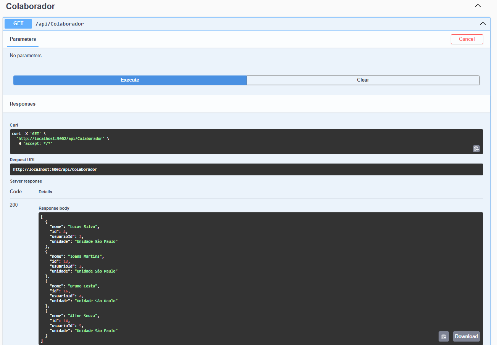
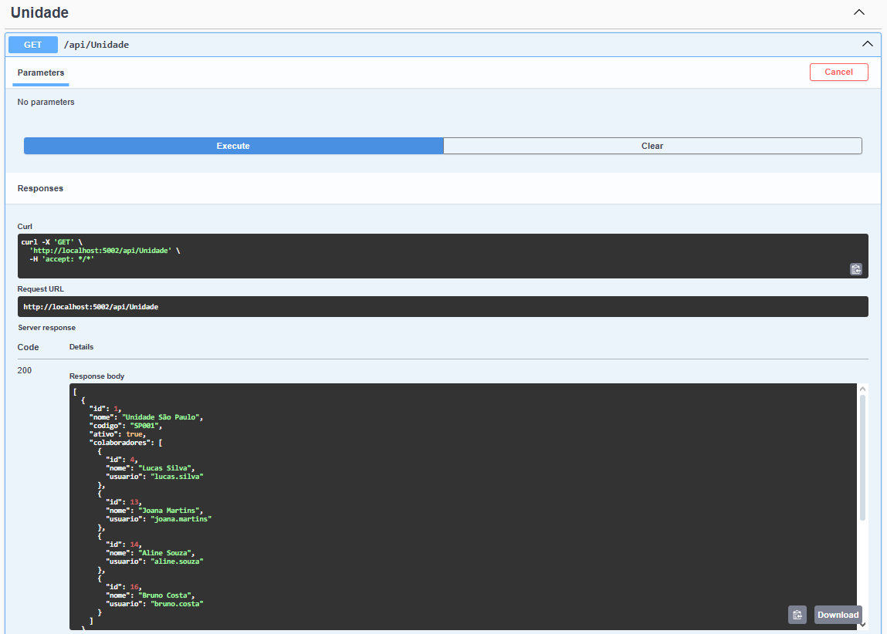
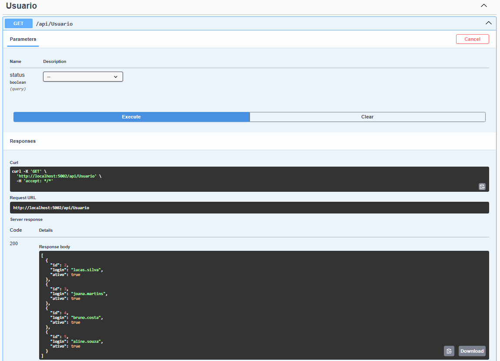

# Sistema de Gestão de Colaboradores e Unidades

Backend desenvolvido em .NET 6 com PostgreSQL e autenticação via JWT.

Repositório: [gabrielsilva-20250326](https://github.com/gabrielsilva3107/gabrielsilva-20250326)

---

## ✅ Funcionalidades

- CRUD completo de Usuários, Colaboradores e Unidades
- Filtros por status (ativos/inativos)
- Regras de negócio implementadas:
  - Não permite cadastro de colaborador em unidade inativa
  - Login único por usuário
- Relacionamentos corretos via Entity Framework
- Autenticação com JWT (Bearer Token)
- Testes via Swagger UI

---

## 🚀 Como rodar o projeto

1. Inicie o container do PostgreSQL:

```bash
docker start pgfinal
```

2. Rode o projeto:

```bash
dotnet run
```

3. Acesse a documentação interativa no navegador:

[http://localhost:5002/swagger/index.html](http://localhost:5002/swagger/index.html)

---

## 🔐 Autenticação JWT

Para obter um token de acesso:

1. Use o endpoint `POST /api/Auth/login`
2. Corpo da requisição (exemplo):

```json
{
  "login": "lucas.silva",
  "senha": "senha123"
}
```

3. O token será retornado.

---

## 🛠️ Observações Técnicas

- Projeto estruturado em MVC
- Herança aplicada via `BaseEntity`
- Banco PostgreSQL rodando via Docker (porta `5434`)
- `.gitignore` configurado para evitar arquivos desnecessários
- Todos os testes foram realizados pelo Swagger

---

## 📂 Estrutura simplificada

```
Controllers/
Models/
Migrations/
Program.cs
appsettings.json
docker-compose.yml
```

---

## 📸 Testes no Swagger

Aqui estão os resultados dos testes realizados via Swagger:

- Teste da rota de Colaboradores:



- Teste da rota de Unidades:



- Teste da rota de Usuários:



---

Se tiver dúvidas ou quiser rodar o projeto manualmente, basta conferir o Swagger para testar todos os endpoints disponíveis.
